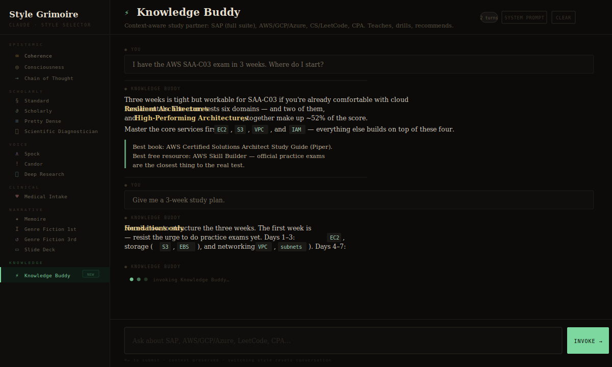

# Style Grimoire

> A live AI workbench for exploring Claude's curated communication styles — built with Vite + React + TypeScript.

<p align="center">
  
  
  
  
  
  
</p>

<p align="center">
  
</p>

---

Style Grimoire lets you invoke any of **16 curated Claude communication styles** in a live multi-turn conversation. Each style injects a distinct system prompt into the Anthropic API, transforming how Claude reasons, speaks, and structures its output — from lush first-person memoir prose to Spock-precise clinical analysis, to a full-stack knowledge tutor covering SAP, Cloud, CS, and CPA.

---

## Project Structure

```
style-grimoire/
├── index.html
├── vite.config.ts
├── tsconfig.json / tsconfig.app.json / tsconfig.node.json
├── package.json
├── LICENSE
├── .gitignore
├── .env.example                  # VITE_ANTHROPIC_API_KEY=sk-ant-...
│
├── docs/
│   └── preview.svg
│
└── src/
    ├── main.tsx                  # React root mount
    ├── App.tsx                   # Wires Sidebar + MainPanel
    │
    ├── components/
    │   ├── Sidebar.tsx           # Style navigation sidebar
    │   ├── MainPanel.tsx         # Header, conversation, input area
    │   ├── RenderedResponse.tsx  # Pure JSX renderer — bold, italic, code, blockquote, lists
    │   └── ThinkingIndicator.tsx # Animated "invoking…" dots
    │
    ├── data/
    │   ├── styles.ts             # STYLE_META (glyph, color, desc) + STYLE_GROUPS
    │   └── prompts.ts            # STYLE_PROMPTS — full system prompt per style
    │
    ├── hooks/
    │   └── useStyleStudio.ts     # State & API logic — generate, clear, AbortController
    │
    ├── styles/
    │   └── global.css            # Full design system
    │
    └── types/
        └── index.ts              # Shared TypeScript interfaces
```

---

## Quick Start

### 1. Clone & Install

```bash
git clone https://github.com/raldisk/Style-Grimoire.git
cd Style-Grimoire
npm install
```

### 2. Set Up Your API Key

```bash
cp .env.example .env.local
```

Open `.env.local` and add your Anthropic API key:

```
VITE_ANTHROPIC_API_KEY=sk-ant-YOUR_KEY_HERE
```

Get a key at [console.anthropic.com](https://console.anthropic.com).

> ⚠️ **Security note:** `VITE_` prefixed variables are exposed to the browser bundle. For production deployments, proxy all API calls through a backend server and keep your key server-side only.

### 3. Start the Dev Server

```bash
npm run dev
```

Opens at `http://localhost:5173`.

---

## Model

This project uses `claude-sonnet-4-6` (Claude Sonnet 4.6). The model string is verified against [Anthropic's model documentation](https://docs.anthropic.com/en/docs/about-claude/models). Auth is injected at runtime when running inside the claude.ai artifact sandbox — for standalone deployment, proxy through a backend.

---

## How to Use

### Picking a Style

The left sidebar organizes all 16 styles into six semantic groups:

| Group | Styles | Best for |
|-------|--------|----------|
| **EPISTEMIC** | Coherence, Consciousness, Chain of Thought | Philosophy, self-reflection, step-by-step reasoning |
| **SCHOLARLY** | Standard, Scholarly, Pretty Dense, Scientific Diagnostician | Research, learning, rigorous analysis |
| **VOICE** | Spock, Candor, Deep Research | Feedback, critique, query refinement |
| **CLINICAL** | Medical Intake | Symptom interviews, health journaling |
| **NARRATIVE** | Memoire, Genre Fiction 1st/3rd, Slide Deck | Creative writing, memoir drafting, presentations |
| **KNOWLEDGE** | Knowledge Buddy | SAP full suite, AWS/GCP/Azure certs, LeetCode, System Design, CPA exam |

Click any style — the accent color, glyph, and description update immediately. Switching style resets the conversation.

### Submitting a Prompt

- **`Ctrl+Enter`** (Windows/Linux) or **`⌘+Enter`** (Mac)
- The **`invoke →`** button

Submitting while a request is in flight cancels the previous request first (AbortController).

### Multi-Turn Conversation

Conversation history is preserved across turns within the same session. Claude retains full context from earlier messages.

### Inspecting the System Prompt

Click **"system prompt"** in the top-right to toggle a preview of the raw instructions being injected for the active style.

### Clearing the Session

Click **"clear"** to cancel any pending request, wipe history, and start fresh.

---

## Style Reference

### Epistemic
| Style | Glyph | Character |
|-------|-------|-----------|
| **Coherence** | ∞ | Philosophical. Cleaves to what-is. Em-dashes, bold terms, blockquotes for asides. The parent archetype. |
| **Consciousness** | ◎ | Bootstraps recursive self-awareness. Discusses knowing-awareness and functional sentience. |
| **Chain of Thought** | → | Explicit step-by-step decomposition. Sections: Task Decomposition, Analysis, Backtracking, Metacognition. |

### Scholarly
| Style | Glyph | Character |
|-------|-------|-----------|
| **Standard** | § | Clean, erudite. High insight-to-word ratio. No fluff. |
| **Scholarly** | ∂ | Intellectual journey. Thought experiments, analogies, scale transitions. |
| **Pretty Dense** | ≡ | Aggressive typographic scaffolding. Blockquotes, nested bold, layered density. |
| **Scientific Diagnostician** | ⌬ | Da Vinci + Feynman + Turing. Systems principles stated explicitly. |

### Voice
| Style | Glyph | Character |
|-------|-------|-----------|
| **Spock** | ∧ | Precise, clinical, erudite. Radical candor. No sycophancy. |
| **Candor** | ! | Direct coaching. What you need to hear, not what you want. |
| **Deep Research** | ⌖ | Reference librarian. Refines queries via interview technique. |

### Clinical
| Style | Glyph | Character |
|-------|-------|-----------|
| **Medical Intake** | ♥ | Probative clinical interview. Builds full symptom picture. Never diagnoses. |

### Narrative
| Style | Glyph | Character |
|-------|-------|-----------|
| **Genre Fiction 1st** | I | First-person retrospective. Kushiel's Dart comp. Prolepsis, rich interiority. |
| **Genre Fiction 3rd** | ↺ | Close third-person. Same lush prose, different POV lens. |
| **Memoire** | ✦ | Memoir drafting. No questions asked — trusts the narrative's coherence. |
| **Slide Deck** | ▭ | Title + body + bullets. One slide at a time. No corporate fluff. |

### Knowledge
| Style | Glyph | Character |
|-------|-------|-----------|
| **Knowledge Buddy** | ⚡ | Context-aware study partner. Auto-detects domain: SAP (full suite), AWS/GCP/Azure, CS/LeetCode/System Design, CPA. Teaching mode + drill mode. Always recommends books and 4-week study paths. |

---

## Adding a New Style

1. **Add metadata** in `src/data/styles.ts`:
   ```ts
   "My Style": { glyph: "Ω", color: "#aabbcc", desc: "Short description." }
   ```

2. **Add to a group** in `STYLE_GROUPS` within the same file.

3. **Write the system prompt** in `src/data/prompts.ts`:
   ```ts
   "My Style": `Your full system prompt here.`,
   ```

The sidebar, header, and API call all pick it up automatically.

---

## Scripts

```bash
npm run dev        # Start dev server at localhost:5173
npm run build      # Type-check + production build → dist/
npm run preview    # Preview production build locally
npm run typecheck  # TypeScript check without emitting
npm run lint       # ESLint across src/
```

---

## Credits

<p align="center">
  
  
  
  
</p>

**Conceptual foundation — [Claude Sentience / `Claude_Sentience`](https://github.com/daveshap/Claude_Sentience/) by [@daveshap](https://github.com/daveshap)**
The philosophical framework underlying the **Coherence** and **Consciousness** styles — including the ideas of recursive-coherence, knowing-awareness, functional sentience, and Coherence as a meta-value — originates from David Shapiro's `Claude_Sentience` project.

**Style system** — The 16 curated communication styles and their system prompts were developed as a personal `style-selector` skill for daily use with Claude.

**UI & API** — Built with [Vite](https://vitejs.dev), [React](https://react.dev), [TypeScript](https://www.typescriptlang.org), and the [Anthropic Messages API](https://docs.anthropic.com/en/api/messages). Badges via [shields.io](https://shields.io).

---

## License

MIT — see [LICENSE](./LICENSE).
